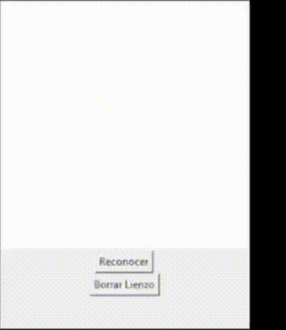

# Reconocedor de Dígitos
Este proyecto es una pequeña aplicación de reconocimiento de dígitos manuscritos que te permite dibujar un dígito en un lienzo y luego utilizar un modelo de aprendizaje profundo para reconocer el dígito dibujado.



El código utiliza Python y las siguientes bibliotecas:
## Instalar antes de usar:
- Tkinter
- PIL
- TensorFlow
- NumPy
  
## Cómo Usar la Aplicación

1. Ejecuta el código en un entorno de Python que tenga todas las dependencias instaladas.
```bash
python reconocedor_de_digitos.py
```

3. Aparecerá una ventana con un lienzo en blanco y dos botones: "Reconocer" y "Borrar Lienzo".

4. Dibuja un dígito en el lienzo utilizando el mouse.

5. Haz clic en el botón "Reconocer" para que la aplicación utilice el modelo de reconocimiento para adivinar qué dígito has dibujado.

6. La predicción se mostrará en la ventana.

7. Puedes hacer clic en el botón "Borrar Lienzo" para borrar el dibujo y realizar una nueva predicción.

## Modelo de Reconocimiento

La aplicación utiliza un modelo previamente entrenado para reconocer dígitos escritos a mano. El modelo se carga desde el archivo `modelo/modelo_digitos.keras`.

Tambien se adjunta el codigo con el cual fue entrenado el modelo y asi entrenar modelos con diferentes datasets o mejorar el entrenamiento

## Contactos:
Si te gusta mi trabajo o estás buscando consultoría para tus proyectos, Pentesting, servicios de RED TEAM - BLUE TEAM, implementación de normas de seguridad e ISOs, controles IDS - IPS, gestión de SIEM, implementación de topologías de red seguras, entrenamiento e implementación de modelos de IA, desarrollo de sistemas, Apps Móviles, Diseño Gráfico, Marketing Digital y todo lo relacionado con la tecnología, no dudes en contactarme al +591 75764248 y con gusto trabajare contigo.
